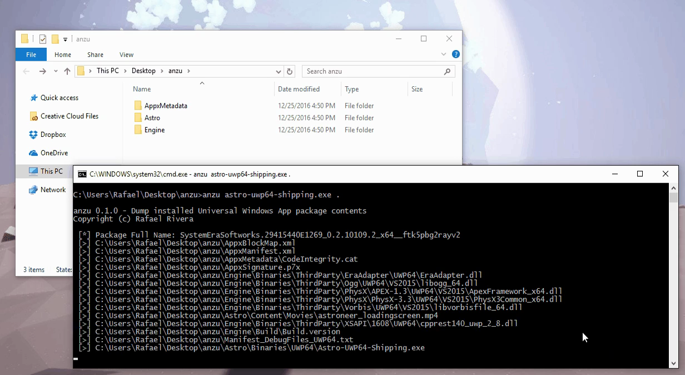

# anzu

Dumps installed Universal Windows App package contents, notably those that are encrypted, with some simple JavaScript.

Powered by [Frida](https://www.frida.re).
 
## Installation and usage ##
1. `npm install --production @withinrafael/anzu`
2. `anzu running-uwp-process.exe .\path\to\destination\folder`
3. Wait.
4. You're done, congratulations.

## Hacking ##
1. Ensure `NODE_ENV` is set correctly
2. `npm install @withinrafael/anzu`
3. `npm run watch` will monitor `src\agent.js` for changes and compile on the fly

## Supported operating systems ##
- Windows 10

## Known issues ##
- anzu will not dump apps that are installed outside %ProgramFiles%\WindowsApps (#1)